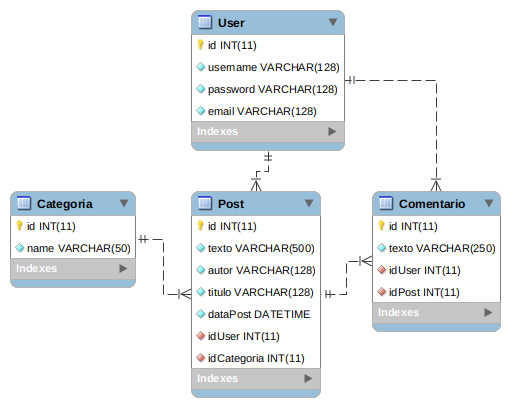

## task-conexa

Abaixo apresenta a modelo do banco de dados criado. Na pasta `db-model` contém os arquivos `source.sql` e `source2.sql` para a criação do mesmo.

* **source.sql:**
Apresenta as querys de criação do banco e das tabelas, bem como alguns inserts e select *.

* **source2.sql:**
Nesse outro arquivo apresenta algumas querys significativas na atividade realizada para consulta no database.